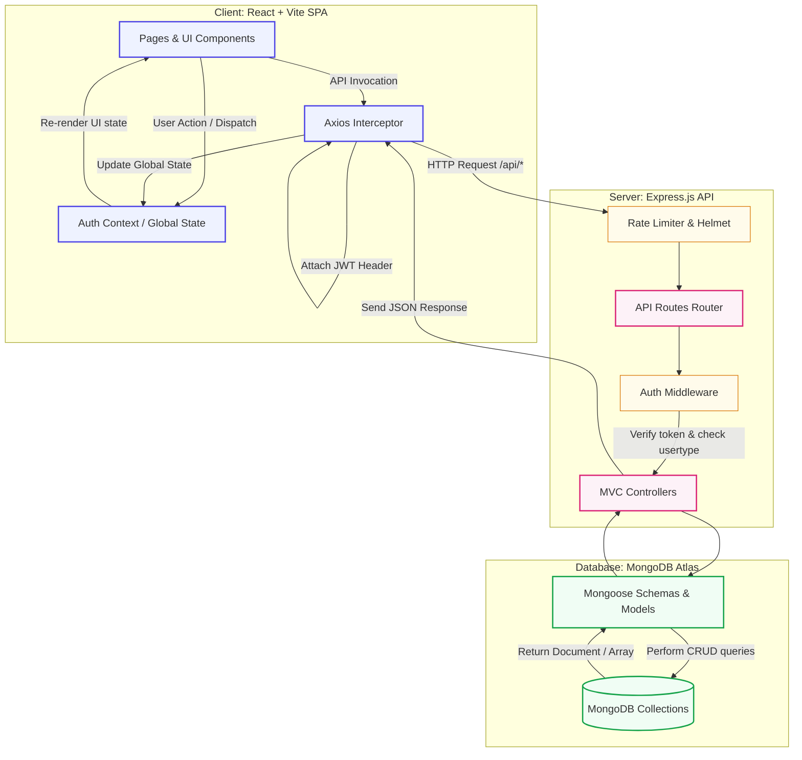

<div align="center">


# 🛒 ShopEZ — E-Commerce Application

**A premium full-stack MERN e-commerce platform with a bespoke vanilla CSS design system, rich admin analytics, JWT authentication, and seamless order management.**

[](https://reactjs.org)
[](https://vitejs.dev)
[](https://nodejs.org)
[](https://expressjs.com)
[](https://mongodb.com)
[](https://jwt.io)
[](LICENSE)

**Developed by [Dhanish Ladwani](https://github.com/dhanish0711/)**

[GitHub Profile](https://github.com/dhanish0711/) · [Report Bug](https://github.com/dhanish0711/shopez-ecommerce/issues) · [Request Feature](https://github.com/dhanish0711/shopez-ecommerce/issues)

</div>

---

## 📋 Table of Contents

- [About the Project](#about-the-project)
- [Features](#features)
- [Tech Stack](#tech-stack)
- [Project Architecture](#project-architecture)
- [Folder Structure](#folder-structure)
- [Getting Started](#getting-started)
- [Environment Variables](#environment-variables)
- [API Documentation](#api-documentation)
- [Database Schema](#database-schema)
- [Demo Accounts](#demo-accounts)
- [Contributing](#contributing)
- [License](#license)

---

## 🌟 About the Project

ShopEZ is a robust, production-ready MERN stack e-commerce application designed to deliver an exceptional online shopping experience. Customers can seamlessly browse products, filter by category/gender, manage a dynamic shopping cart, save items to a wishlist, and place orders. Admins are empowered with a comprehensive dashboard featuring real-time business metrics, dynamic product catalog management, and order fulfillment tracking.

The entire UI is built from scratch using pure vanilla CSS to guarantee unique, lightweight, and custom-tailored layouts that feel premium and modern.

---

## ✨ Features

### 👤 Customer Experience
- 🔐 **Secure Auth** — JWT-based authentication with password hashing (bcryptjs) and persisted sessions.
- 🛍️ **Intuitive Catalog** — Browse catalog with real-time text search, gender & category filters, and multi-option sorting (price/discount).
- ⭐ **Social Proof** — Star ratings and user review counts visible on all product listings.
- 🛒 **Dynamic Cart** — In-memory cart synchronization with backend, supporting quantity adjustment and instant summary updates.
- 📦 **Order Tracker** — Transparent checkout flow with order history, status details, and expected delivery times.
- 💖 **Wishlist** — Toggle favorite products to easily save them for future shopping.

### 👑 Admin Control Panel
- 📊 **Insightful Dashboard** — Real-time analytics charts displaying monthly revenues, order distributions, user registration statistics, and best-selling products.
- 🛍️ **Product Builder** — Dynamic form to publish new products complete with live component preview.
- 📋 **Order Fulfillment** — Manage order lists with status controls (`order placed`, `processing`, `shipped`, `delivered`, `cancelled`).
- 👥 **User Auditing** — View all user profiles and manage customer registrations.

### 🛡️ Production & Security
- 🔒 **Express Security** — Implemented `helmet` to secure HTTP headers.
- 🚦 **Rate Limiting** — Configured to prevent brute force on authentication (30 reqs / 15 mins) and API routes (300 reqs / 15 mins).
- 🗜️ **Compression** — Middleware enabled to zip responses, improving load times.
- 🔌 **CORS Setup** — Strictly configured origin access for secure cross-origin resource sharing.

---

## 🛠️ Tech Stack

| Component | Technology | Description |
|---|---|---|
| **Frontend Core** | React 18, Vite | High-performance SPA with Hot Module Replacement |
| **Routing** | React Router v6 | Client-side routing with navigation guards |
| **State Management** | Context API | Global authentication and application state |
| **Styling** | Vanilla CSS | Bespoke custom design system and variables |
| **API Client** | Axios | Configured with automatic JWT request interceptor |
| **Backend Core** | Node.js, Express.js 5 | Modular server structure following the MVC pattern |
| **Database** | MongoDB Atlas, Mongoose | Cloud-hosted NoSQL database with ODM schema validation |
| **Security & Utilities** | Helmet, bcryptjs, JWT | Security headers, password hashing, and token auth |

---

## 🏗️ Project Architecture

The application is structured around a decoupled Client-Server architecture. The React SPA communicates with the Express REST API via HTTPS, using JSON payloads. Security and authentication are maintained through JSON Web Tokens (JWT) stored client-side and verified server-side on protected endpoints.



---

## 📂 Folder Structure

```
SHOPEZ E-Commerce Application/
├── 📁 Client/                    # React + Vite Frontend SPA
│   ├── 📁 public/                # Static assets (favicons, etc.)
│   ├── 📁 src/
│   │   ├── 📁 assets/            # App-wide images and graphics
│   │   ├── 📁 components/        # Reusable UI elements
│   │   │   ├── AdminLayout.jsx   # Sidebar & Header wrapper for admin dashboard
│   │   │   ├── Footer.jsx        # Footer component
│   │   │   ├── Navbar.jsx        # Navigation bar
│   │   │   └── ProductCard.jsx   # Interactive catalog product card
│   │   ├── 📁 context/
│   │   │   └── AuthContext.jsx   # Authentication context & state manager
│   │   ├── 📁 pages/             # Page views
│   │   │   ├── Home.jsx          # Hero page with banners & categories
│   │   │   ├── Products.jsx      # Catalog with search, filters & sort
│   │   │   ├── Login.jsx         # Sign-in page
│   │   │   ├── Register.jsx      # Account creation page
│   │   │   ├── Cart.jsx          # Shopping cart checkout overview
│   │   │   ├── Profile.jsx       # User profile & past order list
│   │   │   ├── OrderDetails.jsx  # Finalize shipping info & payment method
│   │   │   └── 📁 admin/         # Administrative views
│   │   │       ├── AdminDashboard.jsx # Dashboard analytics, charts & statistics
│   │   │       ├── AllOrders.jsx      # Order list manager
│   │   │       ├── AllProducts.jsx    # Product list manager
│   │   │       └── NewProduct.jsx     # New product publisher with live preview
│   │   ├── 📁 utils/
│   │   │   └── api.js            # Axios client setup with JWT token headers interceptor
│   │   ├── App.jsx               # Main router & page routes definition
│   │   ├── main.jsx              # React application entry point
│   │   └── index.css             # Main styling, design variables, and layout styles
│   ├── index.html                # App entry index
│   ├── vite.config.js            # Vite setup configured with API proxy redirects
│   └── package.json              # Frontend package manifest
│
├── 📁 Server/                    # Node.js + Express Backend
│   ├── 📁 config/
│   │   └── db.js                 # MongoDB connection logic
│   ├── 📁 controllers/           # MVC Controllers
│   │   ├── adminController.js    # Handles admin analytics and user listing
│   │   ├── cartController.js     # Manages cart retrieval, updates & additions
│   │   ├── orderController.js    # Handles order processing & order tracking
│   │   ├── productController.js  # Product queries, search, filter and details
│   │   └── userController.js     # User registration, login, and profile updates
│   ├── 📁 middleware/
│   │   └── authMiddleware.js     # Token verification & admin privilege validation
│   ├── 📁 models/
│   │   └── Schema.js             # Mongoose Schemas (User, Admin, Product, Order, Cart)
│   ├── 📁 routes/                # Express Route routers
│   │   ├── adminRoutes.js        # Admin specific paths
│   │   ├── cartRoutes.js         # Cart operations paths
│   │   ├── orderRoutes.js        # Order operations paths
│   │   ├── productRoutes.js      # Product query and update paths
│   │   └── userRoutes.js         # Authentication & user profile paths
│   ├── server.js                 # Express server entry point
│   ├── seed.js                   # MongoDB initial data seeder
│   ├── .env.example              # Server environment variable template
│   └── package.json              # Backend package manifest
│
├── package.json                  # Root manifest — starts client + server concurrently
├── .gitignore                    # Main git exclude patterns
└── README.md                     # Documentation file
```

---

## 🚀 Getting Started

### Prerequisites

- [Node.js](https://nodejs.org) v16.0.0 or higher
- [npm](https://www.npmjs.com) v8.0.0 or higher
- [MongoDB Atlas](https://www.mongodb.com/cloud/atlas) cluster account or local MongoDB instance running

### 1. Clone the Project

```bash
git clone https://github.com/dhanish0711/SHOPEZ--E-commerce-Application.git
cd "SHOPEZ  E-commerce Application"
```

### 2. Install Dependencies

You can install all dependencies (for Root, Client, and Server) with a single command:

```bash
npm run install:all
```

Alternatively, you can install them manually:

```bash
# Root dependencies
npm install

# Client dependencies
cd Client && npm install

# Server dependencies
cd ../Server && npm install
```

### 3. Environment Configuration

Create a `.env` configuration file in the `Server/` directory by copying the template file:

```bash
cp Server/.env.example Server/.env
```

Open the newly created `Server/.env` file and define the configuration values:

```env
PORT=5000
MONGO_URI=mongodb+srv://<username>:<password>@<cluster>.mongodb.net/shopez
JWT_SECRET=your_jwt_secret_key_here
NODE_ENV=development
```

### 4. Seed Database (Recommended)

Generate sample products, seed customer accounts, populate historical orders, and create the admin dashboard records:

```bash
# Run from the root directory
npm run seed
```

### 5. Launch the Application

Start both the frontend client and the backend server concurrently:

```bash
# Run from the root directory
npm run dev
```

| Application | Address |
|---|---|
| **Frontend client** | `http://localhost:5173` |
| **Backend server** | `http://localhost:5000` |
| **Server Health endpoint** | `http://localhost:5000/api/health` |

---

## 📡 API Documentation

### Base API URL: `http://localhost:5000/api`

#### 🔐 Authentication & Profile
| Method | Endpoint | Auth | Description |
|---|---|---|---|
| `POST` | `/users/register` | Public | Registers a new user account |
| `POST` | `/users/login` | Public | Auths user credentials and returns JWT token |
| `GET` | `/users/profile` | ✅ User | Retrieves details of authenticated user |
| `PUT` | `/users/profile` | ✅ User | Updates user profile details |
| `GET` | `/users` | 👑 Admin | Lists all user accounts in database |
| `DELETE` | `/users/:id` | 👑 Admin | Deletes a user account by ID |

#### 🛍️ Products
| Method | Endpoint | Auth | Description |
|---|---|---|---|
| `GET` | `/products` | Public | Retrieves all products (supports query params: `search`, `gender`, `category`, `sort`, `minPrice`, `maxPrice`) |
| `GET` | `/products/categories` | Public | Retrieves distinct categories list |
| `GET` | `/products/:id` | Public | Retrieves a single product's details by ID |
| `POST` | `/products` | 👑 Admin | Creates a new product |
| `PUT` | `/products/:id` | 👑 Admin | Updates an existing product's details |
| `DELETE` | `/products/:id` | 👑 Admin | Deletes a product by ID |

#### 🛒 Cart Management
| Method | Endpoint | Auth | Description |
|---|---|---|---|
| `GET` | `/cart` | ✅ User | Retrieves current items in the user's cart |
| `POST` | `/cart` | ✅ User | Adds a product to the user's cart |
| `PUT` | `/cart/:id` | ✅ User | Updates the quantity of a specific cart item |
| `DELETE` | `/cart/clear` | ✅ User | Clears all items from the user's cart |
| `DELETE` | `/cart/:id` | ✅ User | Removes a specific product item from the cart |

#### 📦 Orders
| Method | Endpoint | Auth | Description |
|---|---|---|---|
| `POST` | `/orders` | ✅ User | Submits and places a new order |
| `GET` | `/orders/myorders` | ✅ User | Retrieves orders placed by the current user |
| `GET` | `/orders/:id` | ✅ User | Retrieves details of a specific order by ID |
| `GET` | `/orders` | 👑 Admin | Lists all orders in the system |
| `PUT` | `/orders/:id/status` | 👑 Admin | Updates the status of an order |
| `DELETE` | `/orders/:id` | 👑 Admin | Deletes an order record by ID |

#### 📊 Admin Management
| Method | Endpoint | Auth | Description |
|---|---|---|---|
| `GET` | `/admin` | Public | Retrieves public page data (banner, category list) |
| `GET` | `/admin/dashboard` | 👑 Admin | Gathers store-wide analytics (revenue, chart data, top-selling items) |
| `PUT` | `/admin/banner` | 👑 Admin | Updates the store-wide homepage banner |
| `PUT` | `/admin/categories` | 👑 Admin | Updates the allowed list of categories |

---

## 🗄️ Database Schemas

### User Schema (`users` collection)
```javascript
{
  username: { type: String },
  email:    { type: String },
  password: { type: String }, // Hashed using bcryptjs
  usertype: { type: String }  // 'user' | 'admin'
}
```

### Product Schema (`products` collection)
```javascript
{
  title:       { type: String },
  description: { type: String },
  mainImg:     { type: String },
  carousel:    { type: Array },  // Gallery image URLs
  sizes:       { type: Array },  // Available sizes (e.g. S, M, L, XL)
  category:    { type: String },
  gender:      { type: String }, // 'Men' | 'Women' | 'Unisex'
  price:       { type: Number },
  discount:    { type: Number }  // Discount percentage
}
```

### Order Schema (`orders` collection)
```javascript
{
  userId:        { type: String },
  name:          { type: String },
  email:         { type: String },
  mobile:        { type: String },
  address:       { type: String },
  pincode:       { type: String },
  title:         { type: String },
  description:   { type: String },
  mainImg:       { type: String },
  size:          { type: String },
  quantity:      { type: Number },
  price:         { type: Number },
  discount:      { type: Number },
  paymentMethod: { type: String },
  orderDate:     { type: String },
  deliveryDate:  { type: String },
  orderStatus:   { type: String, default: 'order placed' }
}
```

### Cart Schema (`cart` collection)
```javascript
{
  userId:      { type: String },
  title:       { type: String },
  description: { type: String },
  mainImg:     { type: String },
  size:        { type: String },
  quantity:    { type: String }, // Stored as String
  price:       { type: Number },
  discount:    { type: Number }
}
```

### Admin Schema (`admin` collection)
```javascript
{
  banner:     { type: String }, // Homepage banner image URL
  categories: { type: Array }   // Allowed categories array
}
```

---

## 🔑 Demo Accounts

Run `npm run seed` to automatically seed these sample credentials:

| Role | Email | Password |
|---|---|---|
| 👑 **Store Admin** | `admin@shopez.com` | `admin123` |
| 👤 **Customer Account 1** | `rahul@example.com` | `user123` |
| 👤 **Customer Account 2** | `priya@example.com` | `user123` |
| 👤 **Customer Account 3** | `arjun@example.com` | `user123` |

---

## 🤝 Contributing

1. Fork the project repository.
2. Create your feature branch: `git checkout -b feature/AmazingFeature`
3. Commit your changes: `git commit -m 'Add some AmazingFeature'`
4. Push to the branch: `git push origin feature/AmazingFeature`
5. Open a Pull Request.

---

## 📄 License

Distributed under the MIT License. See [`LICENSE`](LICENSE) for details.

---

<div align="center">

Made with ❤️ by **[Dhanish Ladwani](https://github.com/dhanish0711/)**

[](https://github.com/dhanish0711/)

⭐ **Star this repository if you found it helpful!**

</div>
